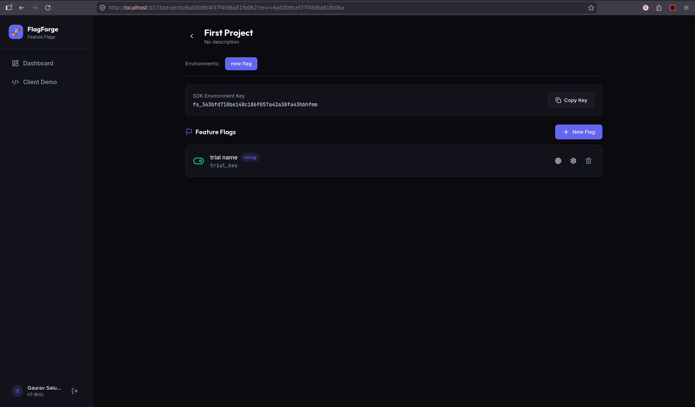

# FlagForge

A modern feature flag management platform for controlling feature rollouts across different environments.

## About

**FlagForge** is a feature flag management system that enables development teams to control the rollout of software features in a safe, controlled, and granular manner. Feature flags (also known as toggle flags or feature switches) are a powerful software development technique that allows you to decouple feature deployment from code release.



### What It Does

FlagForge provides a centralized platform where teams can:

- **Create and manage feature flags** across multiple projects and environments
- **Control feature visibility** without redeploying code
- **Perform gradual rollouts** by enabling features for specific percentages of users
- **Run A/B tests** by toggling features for different user segments
- **Kill switches** - instantly disable problematic features in production without rolling back code
- **Multi-environment management** - maintain separate flag configurations for development, staging, and production

### Industry-Level Benefits

In large-scale organizations, feature flags are essential for:

1. **Safe Deployments** - Reduce risk by rolling out features to a small subset of users first. If issues arise, simply toggle the flag off without requiring a hotfix or rollback.

2. **Continuous Deployment** - Teams can merge code for unfinished features without exposing them to users. Features remain "hidden" until ready, enabling faster iteration cycles.

3. **Compliance & Auditing** - Maintain a clear record of who changed which flag and when, essential for regulated industries.

4. **Developer Velocity** - Developers can work on multiple features in parallel without interfering with each other, merging code freely and activating features independently.


### Why Enterprise-Grade Matters

FlagForge is designed with industry requirements in mind:

- **Multi-tenancy** - Support for multiple organizations with isolated data
- **Real-time synchronization** - WebSocket-based updates ensure flag changes propagate instantly across all connected clients
- **Scalable architecture** - Redis-backed caching ensures low-latency flag evaluation even at scale
- **Security** - JWT-based authentication and role-based access control

## Features

- **Organization Management** - Create and manage multiple organizations
- **Project Management** - Organize feature flags by project
- **Environment Support** - Create environments (Production, Staging, Development, etc.)
- **Feature Flags** - Create, update, and toggle feature flags per environment
- **Real-time Updates** - WebSocket-powered live flag evaluations
- **SDK Integration** - Client-side SDK for evaluating flags in your applications

## Tech Stack

### Backend
- Node.js + Express
- MongoDB (Mongoose ODM)
- Redis (caching & pub/sub)
- Socket.IO (real-time communication)
- JWT Authentication
- bcryptjs (password hashing)

### Frontend
- React 18
- Vite (build tool)
- Tailwind CSS
- React Router DOM
- Socket.IO Client
- Axios
- Lucide React (icons)

## Getting Started

### Prerequisites

- Node.js 18+
- MongoDB
- Redis

### Installation

1. Clone the repository:
```bash
git clone https://github.com/notstanzinn/feature-flag-service
```

2. Install backend dependencies:
```bash
cd backend
npm install
```

3. Install frontend dependencies:
```bash
cd frontend
npm install
```

4. Configure environment variables:

Copy `.env.example` to `.env` in the backend directory and update the values:
```bash
cd backend
cp .env.example .env
```

5. Start the backend server:
```bash
cd backend
npm run dev
```

6. Start the frontend development server:
```bash
cd frontend
npm run dev
```

The application will be available at `http://localhost:5173`

## Project Structure

```
final-project/
├── backend/
│   ├── src/
│   │   ├── config/        # Database & Redis configuration
│   │   ├── middleware/     # Auth middleware
│   │   ├── models/        # Mongoose models
│   │   ├── routes/        # API routes
│   │   ├── services/      # Business logic
│   │   ├── socket/        # Socket.IO handlers
│   │   └── index.js       # Entry point
│   └── package.json
├── frontend/
│   ├── src/
│   │   ├── components/    # Reusable UI components
│   │   ├── context/       # React context providers
│   │   ├── hooks/         # Custom React hooks
│   │   ├── lib/           # Utilities
│   │   ├── pages/         # Page components
│   │   ├── services/      # API client
│   │   ├── App.jsx        # Main app component
│   │   └── main.jsx       # Entry point
│   ├── index.html
│   └── package.json
└── README.md
```


## Author : **notstanzinn**
